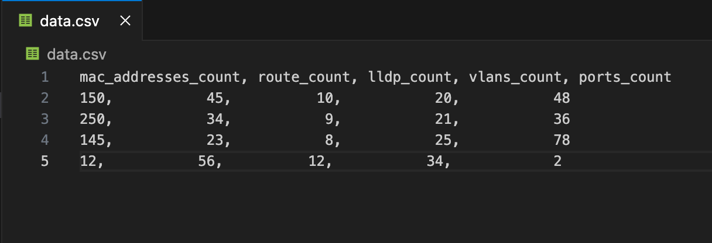
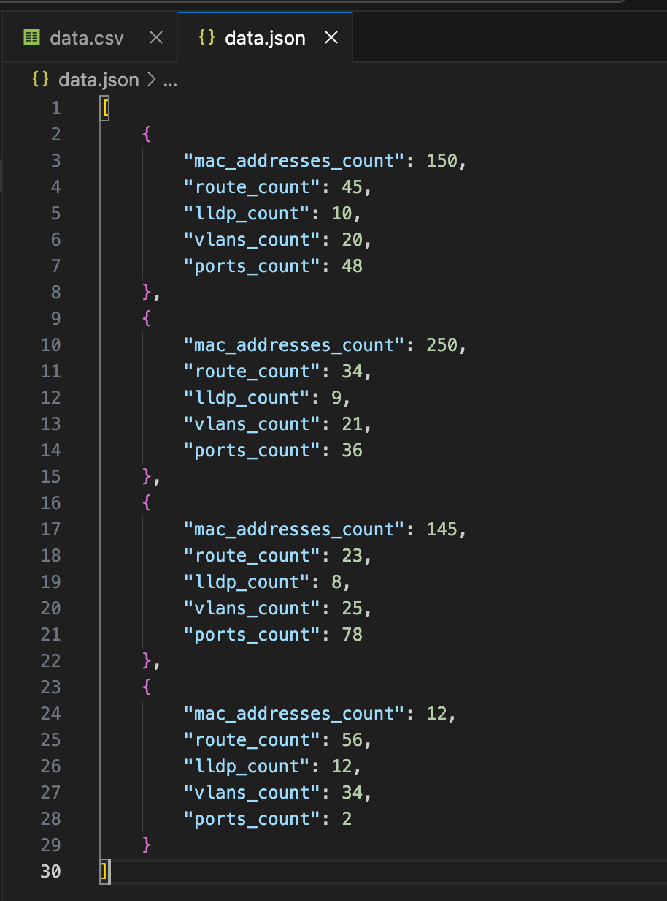

## Pandas Library

The `pandas` library is a powerful and flexible open-source data analysis and manipulation tool built on top of the Python programming language. It is widely used in data science, machine learning, and data analysis projects due to its ability to handle large datasets efficiently and its rich set of functionalities.

.toc { margin: 20px; padding: 10px; border: 1px solid #ccc; } .toc h2 { cursor: pointer; } .toc h3 { cursor: pointer; } .toc h4 { cursor: pointer; } .toc-content { display: none; margin-top: 10px; } .toc-content ul ul { margin-left: 20px; }

### Table of Contents

-   [Introduction to Pandas](#section1)
-   [Pandas Series](#section2)

-   [Create Pandas Series with a List](#section2-1)
-   [Create Pandas Series with a Dictionary](#section2-2)
-   [Filter Pandas Series](#section2-3)

-   [Pandas DataFrames](#section3)

-   [Create Pandas DataFrame with a Dictionary](#section3-1)
-   [Filter Pandas DataFrame with a single row](#section3-2)
-   [Filter Pandas DataFrame with a multiple row](#section3-3)
-   [Customize DataFrame index Value](#section3-4)

-   [Pandas File Operations](#section4)

-   [Reading a CSV Files](#section4-1)
-   [Reading a JSON File](#section4-2)

-   [Conclusion](#section6)

function toggleTOC() { var tocContent = document.querySelector('.toc-content'); if (tocContent.style.display === "none" || tocContent.style.display === "") { tocContent.style.display = "block"; } else { tocContent.style.display = "none"; } }

### Pandas Series

This is a one-dimensional array that can hold any type of data. This is just like a column in a table

#### Create Pandas Series with a List

```python
import pandas as pd
data = ["netmiko", "scrapli", "nornir"]
variable = pd.Series(data)
```

```python
In [1]: import pandas as pd
   ...: data = ["netmiko", "scrapli", "nornir"]
   ...: variable = pd.Series(data)

In [2]: variable
Out[2]: 
0    netmiko
1    scrapli
2     nornir
dtype: object
```

The index starts from 0 by default. To customize the index, you can do it this way:

```python
In [5]: import pandas as pd
   ...: data = ["netmiko", "scrapli", "nornir"]
   ...: variable = pd.Series(data, index=["a", "b", "c"])

In [6]: variable
Out[6]: 
a    netmiko
b    scrapli
c     nornir
dtype: object
```

#### Create Pandas Series with a Dictionary

As mentioned earlier, a Pandas Series can contain any kind of data type. Here is an example using a Python dictionary:

```python
import pandas as pd

# Create a dictionary with network metrics and their counts
network_metrics = {
    'total_number_of_mac_addresses_count': 150,
    'total_number_of_route_count': 45,
    'lldp_neighbor_count': 10,
    'total_number_of_vlans_count': 20,
    'total_number_of_ports_count': 48
}

# Create a Pandas Series from the dictionary
metrics_series = pd.Series(network_metrics)

# Display the Series
print(metrics_series)
```

The index has become the key of the dictionary.

```python
In [7]: import pandas as pd
   ...: 
   ...: # Create a dictionary with network metrics and their counts
   ...: network_metrics = {
   ...:     'total_number_of_mac_addresses_count': 150,
   ...:     'total_number_of_route_count': 45,
   ...:     'lldp_neighbor_count': 10,
   ...:     'total_number_of_vlans_count': 20,
   ...:     'total_number_of_ports_count': 48
   ...: }
   ...: 
   ...: # Create a Pandas Series from the dictionary
   ...: metrics_series = pd.Series(network_metrics)

In [8]: metrics_series
Out[8]: 
total_number_of_mac_addresses_count    150
total_number_of_route_count             45
lldp_neighbor_count                     10
total_number_of_vlans_count             20
total_number_of_ports_count             48
dtype: int64
```

#### Filter Pandas Series

Let's create a series with only "lldp\_neighbor\_count" and "total\_number\_of\_route\_count". This is kind of a filtering inside of a Pandas Series

```python
In [26]: metrics_series = pd.Series(network_metrics, index=["lldp_neighbor_count", "total_number_of_route_count"])

In [27]: metrics_series
Out[27]: 
lldp_neighbor_count            10
total_number_of_route_count    45
dtype: int64
```

Now we only see these two values from the Series.  

### Pandas DataFrames

A Pandas DataFrame is a two-dimensional data structure, similar to a table with rows and columns or a two-dimensional array.

Here is a sample of my data:

```python
network_metrics = {
    'mac_addresses_count': [150, 250, 145, 12],
    'route_count': [45, 34, 23, 56],
    'lldp_count': [10, 9, 8, 12],
    'vlans_count': [20, 21, 25, 34],
    'ports_count': [48, 36, 78, 2]
}
```

#### Create Pandas DataFrame with a Dictionary

Let's create a Pandas Dataframe and print this data:

```python
In [35]: network_metrics = {
    ...:     'mac_addresses_count': [150, 250, 145, 12],
    ...:     'route_count': [45, 34, 23, 56],
    ...:     'lldp_count': [10, 9, 8, 12],
    ...:     'vlans_count': [20, 21, 25, 34],
    ...:     'ports_count': [48, 36, 78, 2]
    ...: }

In [36]: df = pd.DataFrame(network_metrics)

In [37]: df
Out[37]: 
   mac_addresses_count  route_count  lldp_count  vlans_count  ports_count
0                  150           45          10           20           48
1                  250           34           9           21           36
2                  145           23           8           25           78
3                   12           56          12           34            2
```

#### Filter Pandas DataFrame witha single row

This can we done with "**Locate Row**" attribute very easily.

-   If we want to return only **single** row:

```python
In [51]: df
Out[51]: 
   mac_addresses_count  route_count  lldp_count  vlans_count  ports_count
0                  150           45          10           20           48
1                  250           34           9           21           36
2                  145           23           8           25           78
3                   12           56          12           34            2

In [52]: 

In [52]: df.loc[0]
Out[52]: 
mac_addresses_count    150
route_count             45
lldp_count              10
vlans_count             20
ports_count             48
Name: 0, dtype: int64
```

💡

df.loc\[Index\_number\] operation return Pandas Series.  
  
In \[54\]: type(df.loc\[0\])  
Out\[54\]: pandas.core.series.Series

#### Filter Pandas DataFrame witha multiple row

-   To Return multiple rows

```python
In [55]: df
Out[55]: 
   mac_addresses_count  route_count  lldp_count  vlans_count  ports_count
0                  150           45          10           20           48
1                  250           34           9           21           36
2                  145           23           8           25           78
3                   12           56          12           34            2

df.loc[[0,2]]

mac_addresses_count  route_count  lldp_count  vlans_count  ports_count
0                  150           45          10           20           48
2                  145           23           8           25           78

In [57]: 
```

💡

df.loc\[\[Index\_number, Index\_number\]\] operation return Pandas DataFrame.  
  
In \[57\]: type(df.loc\[\[0,2\]\])  
Out\[57\]: pandas.core.frame.DataFrame

#### Customize DataFrame index Value

We can customize the index values while we craete the DataFrame:

```python
import pandas as pd

network_metrics = {
    'mac_addresses_count': [150, 250, 145, 12],
    'route_count': [45, 34, 23, 56],
    'lldp_count': [10, 9, 8, 12],
    'vlans_count': [20, 21, 25, 34],
    'ports_count': [48, 36, 78, 2]
}

metrics_devices_df = pd.DataFrame(network_metrics, index = ["device1", "device2", "device3", "device4"])


In [60]: metrics_devices_df
Out[60]: 
         mac_addresses_count  route_count  lldp_count  vlans_count  ports_count
device1                  150           45          10           20           48
device2                  250           34           9           21           36
device3                  145           23           8           25           78
device4                   12           56          12           34            2
```

To filter single device as Pandas Series:

```python
In [61]: metrics_devices_df.loc["device1"]
Out[61]: 
mac_addresses_count    150
route_count             45
lldp_count              10
vlans_count             20
ports_count             48
Name: device1, dtype: int64
```

to filter multiple devices as Pandas DataFrame:

```python
In [62]: metrics_devices_df.loc[["device1", "device3"]]
Out[62]: 
         mac_addresses_count  route_count  lldp_count  vlans_count  ports_count
device1                  150           45          10           20           48
device3                  145           23           8           25           78

In [63]: 
```

### Pandas File Operations

#### Reading CSV File

This is my sample CSV file and I will be crating a DataFrame from this file.



_A sample CSV file_

[

data

data.csv

305 Bytes

.a{fill:none;stroke:currentColor;stroke-linecap:round;stroke-linejoin:round;stroke-width:1.5px;}download-circle

](__GHOST_URL__/content/files/2024/08/data.csv "Download")

We use **read\_csv** method.

```python
In [1]: import pandas as pd

In [2]: df = pd.read_csv('data.csv')

In [3]: df
Out[3]: 
   mac_addresses_count   route_count   lldp_count   vlans_count   ports_count
0                  150            45           10            20            48
1                  250            34            9            21            36
2                  145            23            8            25            78
3                   12            56           12            34             2

In [4]: 

In [4]: df.to_string()
Out[4]: '   mac_addresses_count   route_count   lldp_count   vlans_count   ports_count\n0                  150            45           10            20            48\n1                  250            34            9            21            36\n2                  145            23            8            25            78\n3                   12            56           12            34             2'

In [5]: 

In [5]: 

In [5]: print(df.to_string())
   mac_addresses_count   route_count   lldp_count   vlans_count   ports_count
0                  150            45           10            20            48
1                  250            34            9            21            36
2                  145            23            8            25            78
3                   12            56           12            34             2

In [6]: 
```

#### Reading JSON File

This is my sample JSON file and I will be crating a DataFrame from this file.



[

data

data.json

618 Bytes

.a{fill:none;stroke:currentColor;stroke-linecap:round;stroke-linejoin:round;stroke-width:1.5px;}download-circle

](__GHOST_URL__/content/files/2024/08/data.json "Download")

we use "**read\_json**" method.

```python
In [1]: import pandas as pd
   ...: 
   ...: df = pd.read_json('data.json')

In [2]: df
Out[2]: 
   mac_addresses_count  route_count  lldp_count  vlans_count  ports_count
0                  150           45          10           20           48
1                  250           34           9           21           36
2                  145           23           8           25           78
3                   12           56          12           34            2
```

info about the Dataframe:

```python
In [5]: df.info()
<class 'pandas.core.frame.DataFrame'>
RangeIndex: 4 entries, 0 to 3
Data columns (total 5 columns):
 #   Column               Non-Null Count  Dtype
---  ------               --------------  -----
 0   mac_addresses_count  4 non-null      int64
 1   route_count          4 non-null      int64
 2   lldp_count           4 non-null      int64
 3   vlans_count          4 non-null      int64
 4   ports_count          4 non-null      int64
dtypes: int64(5)
memory usage: 292.0 bytes
```

### Conclusion

In this blog page, I covered the basics of using Pandas for data manipulation. I started with an introduction to Pandas, followed by creating and filtering Pandas Series and DataFrames. I also explored customizing DataFrame indices and performing file operations such as reading CSV and JSON files. With these skills, we are now prepared to handle and analyze data efficiently using Pandas.
