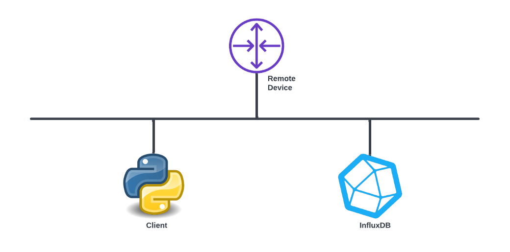
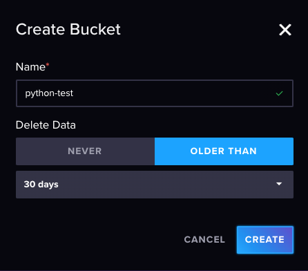
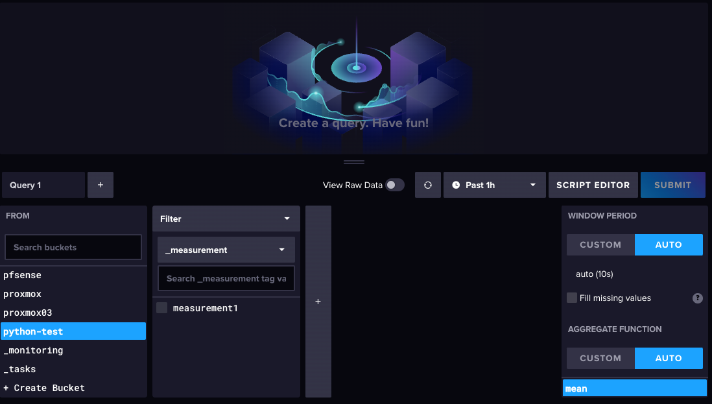
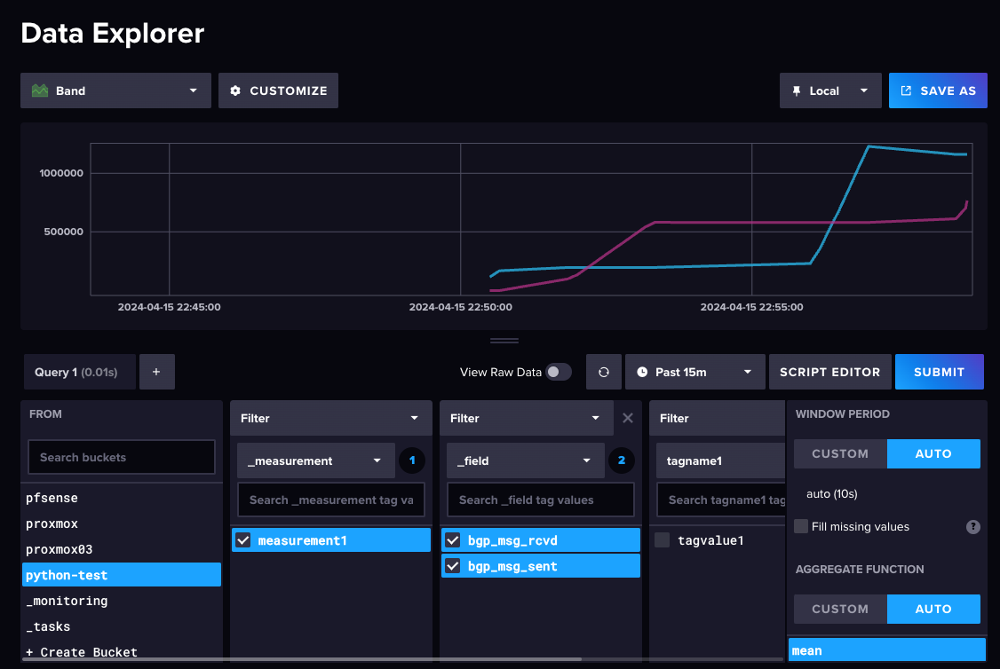
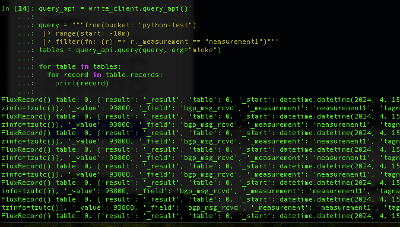

InfluxDB is an open-source time series database developed by InfluxData. It is written in Go and optimized for fast, high-availability storage and retrieval of time series data in fields such as operations monitoring, application metrics, Internet of Things sensor data, and real-time analytics.

In the realm of network administration, data is paramount. Being able to gather, examine, and utilize network data can make the difference between a network that operates smoothly and one that's plagued with issues. In this blog post, we're going to look at how to gather data related to networks - specifically, Border Gateway Protocol (BGP) messages from each neighbor - and how to store this data in InfluxDB using Python.  

### The Setup

Our Python script uses the `netmiko` library to connect to a network device and send commands. In this case, we're connecting to a Cisco device and sending the command `show ip bgp all summary`. This command returns a summary of BGP neighbor information, including the number of messages received and sent.



```python
import influxdb_client, os, time
from influxdb_client import InfluxDBClient, Point, WritePrecision
from influxdb_client.client.write_api import SYNCHRONOUS
from netmiko import ConnectHandler


token = os.environ.get("INFLUXDB_TOKEN")
org = "mteke"
url = "http://192.168.178.61:8086"

write_client = influxdb_client.InfluxDBClient(url=url, token=token, org=org)

bucket="python-test"


#To write data
write_api = write_client.write_api(write_options=SYNCHRONOUS)

#Connecting to BGP Looking Glass router
netconnect = ConnectHandler(ip='route-views.routeviews.org',
                            username='rviews',
                            password='',
                            device_type='cisco_xe')


while True:
  print('Retrieved data')

  response = netconnect.send_command('show ip bgp all summary', use_genie=True)
  bgp_message_received = response['vrf']['default']['neighbor']['4.68.4.46']['address_family']['ipv4 unicast']['msg_rcvd']
  bgp_message_sent = response['vrf']['default']['neighbor']['4.68.4.46']['address_family']['ipv4 unicast']['msg_sent']


  point = (
    Point("measurement1")
    .tag("tagname1", "tagvalue1")
    .field("bgp_msg_rcvd", bgp_message_received)
    .field("bgp_msg_sent", bgp_message_sent)
  )
  write_api.write(bucket=bucket, org="mteke", record=point)
  time.sleep(10) # separate points by 10 second
```

Initiating the creation of a bucket named 'python-test' in InfluxDB.





As illustrated below, a graph has begun to render in the InfluxDB GUI.



To programmatically retrieve values from InfluxDB, you can execute the following:

```python
query_api = write_client.query_api()

query = """from(bucket: "python-test")
 |> range(start: -10m)
 |> filter(fn: (r) => r._measurement == "measurement1")"""
tables = query_api.query(query, org="mteke")

for table in tables:
  for record in table.records:
    print(record)
```



## A Note on Efficiency

While `netmiko` is a powerful library for network automation especially for legacy devices, it may not be the most efficient choice for collecting network data. Protocols like gRPC can offer more efficient data collection, especially for large-scale networks or real-time data streaming. However, the principles of collecting data and writing it to InfluxDB remain the same.

In conclusion, Python provides a powerful and flexible way to collect network data and write it to a time-series database like InfluxDB. Whether you're monitoring BGP messages or any other network metric, this approach can provide valuable insights into your network's operation.
