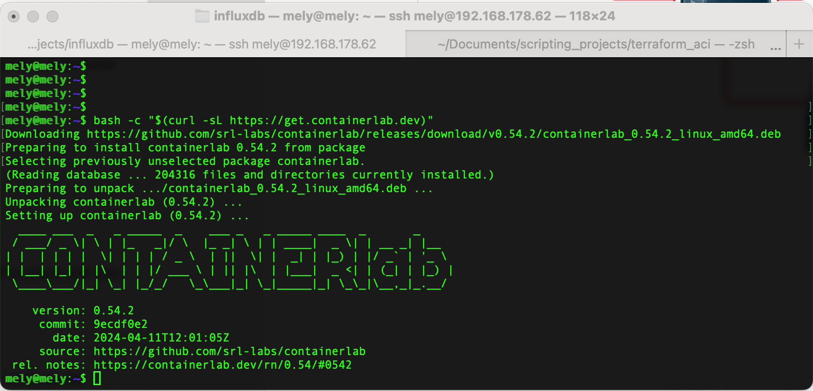

```shell
https://containerlab.dev/quickstart/
```

```shell
# download and install the latest release (may require sudo)
bash -c "$(curl -sL https://get.containerlab.dev)"
```



```shell
mteke1 ~  % scp Downloads/cEOS-lab-4.30.5M.tar mely@192.168.178.62:/home/mely/Documents/containerlab/cEOS-lab-4.30.5M.tar
mely@192.168.178.62's password: 
cEOS-lab-4.30.5M.tar                          100%  467MB  11.6MB/s   00:40


mteke1 Downloads  % scp ./cEOS-lab-4.28.10.1M.tar mely@192.168.178.62:/home/mely/Documents/containerlab/cEOS-lab-4.28.10.1M.tar
mely@192.168.178.62's password: 
cEOS-lab-4.28.10.1M.tar                       100%  438MB  13.0MB/s   00:33    
mteke1 Downloads  % 
```

```shell
mely@mely:~/Documents/containerlab$ ls
cEOS-lab-4.30.5M.tar
mely@mely:~/Documents/containerlab$ 
mely@mely:~/Documents/containerlab$ sudo docker import cEOS-lab-4.30.5M.tar ceos:4.30.5M
sha256:8ee3fce3ebe8864b563671b032d18888b690d7de3474ce8016b1492e45f7898b
mely@mely:~/Documents/containerlab$ 

mely@mely:~/Documents/containerlab$ sudo docker import cEOS-lab-4.28.10.1M.tar ceos:4.28.10.1M
sha256:d2e369bb4ef14a2b728a7509787684c5d7812a501e83ac116459ff474b2c597e
mely@mely:~/Documents/containerlab$ 
```

```shell
mely@mely:~/Documents/containerlab$ sudo docker images
REPOSITORY   TAG       IMAGE ID       CREATED          SIZE
ceos         4.30.5M   8ee3fce3ebe8   58 seconds ago   1.95GB
mely@mely:~/Documents/containerlab$

REPOSITORY   TAG          IMAGE ID       CREATED          SIZE
ceos         4.28.10.1M   d2e369bb4ef1   31 seconds ago   1.89GB
ceos         4.30.5M      8ee3fce3ebe8   2 hours ago      1.95GB
mely@mely:~/Documents/containerlab$ 
```

```yaml
#arista.clab.yml
---
name: arista-labs

mgmt:
  network: mgmt
  ipv4-subnet: 192.168.100.0/24

topology:
  kinds:
    ceos:
      image: ceos:4.28.10.1M
  nodes:
    eos-01:
      kind: ceos
      mgmt-ipv4: 192.168.100.11
    eos-02:
      kind: ceos
      mgmt-ipv4: 192.168.100.12
  links:
    - endpoints: ["eos-01:eth1", "eos-02:eth1"]
```

```shell
mely@mely:~/Documents/containerlab/lab-1$ sudo containerlab deploy --topo arista.clab.yml
INFO[0000] Containerlab v0.54.2 started                 
INFO[0000] Parsing & checking topology file: arista.clab.yml 
INFO[0000] Creating docker network: Name="mgmt", IPv4Subnet="192.168.100.0/24", IPv6Subnet="", MTU=1500 
INFO[0000] Creating lab directory: /home/mely/Documents/containerlab/lab-1/clab-arista-labs 
INFO[0000] config file '/home/mely/Documents/containerlab/lab-1/clab-arista-labs/eos-01/flash/startup-config' for node 'eos-01' already exists and will not be generated/reset 
INFO[0000] config file '/home/mely/Documents/containerlab/lab-1/clab-arista-labs/eos-02/flash/startup-config' for node 'eos-02' already exists and will not be generated/reset 
INFO[0000] Creating container: "eos-01"                 
INFO[0000] Creating container: "eos-02"                 
INFO[0000] Running postdeploy actions for Arista cEOS 'eos-02' node 
INFO[0000] Created link: eos-01:eth1 <--> eos-02:eth1   
INFO[0000] Running postdeploy actions for Arista cEOS 'eos-01' node 
INFO[0041] Adding containerlab host entries to /etc/hosts file 
INFO[0041] Adding ssh config for containerlab nodes     
+---+-------------------------+--------------+-----------------+------+---------+-------------------+--------------+
| # |          Name           | Container ID |      Image      | Kind |  State  |   IPv4 Address    | IPv6 Address |
+---+-------------------------+--------------+-----------------+------+---------+-------------------+--------------+
| 1 | clab-arista-labs-eos-01 | 7290440856ef | ceos:4.28.10.1M | ceos | running | 192.168.100.11/24 | N/A          |
| 2 | clab-arista-labs-eos-02 | 41238c92314a | ceos:4.28.10.1M | ceos | running | 192.168.100.12/24 | N/A          |
+---+-------------------------+--------------+-----------------+------+---------+-------------------+--------------+
```

```shell
# access CLI
docker exec -it <name> Cli
# access bash
docker exec -it <name> bash
```

```shell
mely@mely:~/Documents/containerlab/lab-1$ sudo docker exec -it clab-arista-labs-eos-01 Cli
eos-01>
eos-01>
eos-01>en
eos-01#show ip interface brief 
                                                                                 Address
Interface         IP Address              Status       Protocol           MTU    Owner  
----------------- ----------------------- ------------ -------------- ---------- -------
Management0       192.168.100.11/24       up           up                1500           

eos-01#read escape sequence
mely@mely:~/Documents/containerlab/lab-1$ 
mely@mely:~/Documents/containerlab/lab-1$ 
mely@mely:~/Documents/containerlab/lab-1$ 
mely@mely:~/Documents/containerlab/lab-1$ sudo docker exec -it clab-arista-labs-eos-02 Cli
eos-02>en
eos-02#show ip interface brief 
                                                                                 Address
Interface         IP Address              Status       Protocol           MTU    Owner  
----------------- ----------------------- ------------ -------------- ---------- -------
Management0       192.168.100.12/24       up           up                1500           

eos-02#read escape sequence
mely@mely:~/Documents/containerlab/lab-1$ 
```

[

Sample File

Sample file caption

file\_example\_PDF.pdf

488 KB

.a{fill:none;stroke:currentColor;stroke-linecap:round;stroke-linejoin:round;stroke-width:1.5px;}download-circle

](https://ghost.org/uploads/2017/11/file_example_PDF.pdf "Download")

* * *

[

Picture1

Picture1.png

194 KB

.a{fill:none;stroke:currentColor;stroke-linecap:round;stroke-linejoin:round;stroke-width:1.5px;}download-circle

](__GHOST_URL__/content/files/2024/07/Picture1.png "Download")


💡

The default [CSS](https://github.com/TryGhost/Ghost/blob/c667620d8f2e32c96fe376ad0f3dabc79488532a/ghost/core/core/frontend/src/cards/css/file.css) for the file card provided by Ghost should be used as a reference for custom implementations.


[Go Check the tool](https://www.linkedin.com/in/melih-teke/)

  GitHub Bookmark .bookmark { display: flex; flex-direction: column; align-items: center; justify-content: center; width: 200px; height: 250px; border: 2px solid #000; border-radius: 10px; overflow: hidden; text-align: center; text-decoration: none; color: #000; font-family: Arial, sans-serif; padding: 10px; box-shadow: 0 4px 8px rgba(0, 0, 0, 0.1); } .bookmark img { width: 100px; height: 100px; margin-bottom: 10px; } .bookmark .description { font-size: 14px; margin-bottom: 10px; } .bookmark .url { font-size: 12px; color: #0366d6; word-break: break-all; } [

Short description of the repository goes here.

https://www.cisco.com

](https://www.cisco.com)
