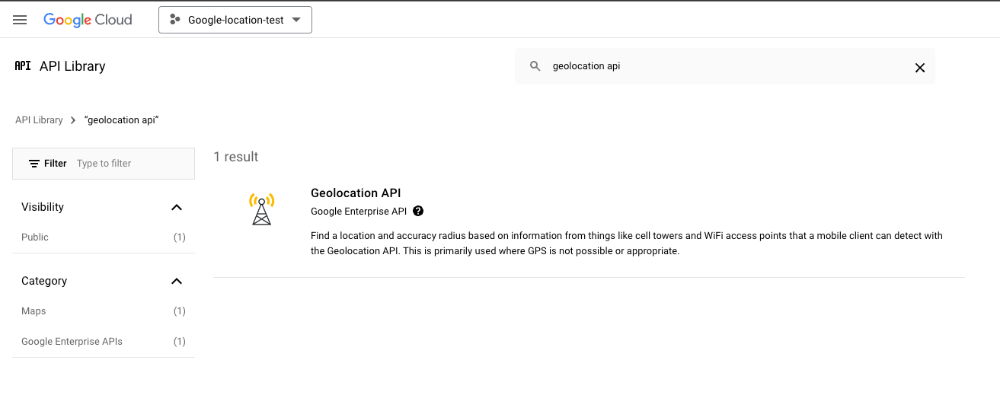

In this post, I will show you how to enable Google's location service on Google Cloud Platform (GCP) and retrieve coordinate data from a physical address using Python and the Google Geolocation API.

### Task: Retrieve Coordinates from Physical address.


.toc { margin: 20px; padding: 10px; border: 1px solid #ccc; } .toc h2 { cursor: pointer; } .toc h3 { cursor: pointer; } .toc h4 { cursor: pointer; } .toc-content { display: none; margin-top: 10px; } .toc-content ul ul { margin-left: 20px; }

### Table of Contents

-   [Enable Google Maps Geolocation API](#section1)
-   [Create Python Code to Convert Postal Address to Coordinates](#section2)
-   [Conclusion](#section3)

function toggleTOC() { var tocContent = document.querySelector('.toc-content'); if (tocContent.style.display === "none" || tocContent.style.display === "") { tocContent.style.display = "block"; } else { tocContent.style.display = "none"; } }

### Step 1: Enable Google Maps Geolocation API

1.  Go to the [Google Cloud Console](vscode-file://vscode-app/Applications/Visual%20Studio%20Code.app/Contents/Resources/app/out/vs/code/electron-sandbox/workbench/workbench.html).
2.  Create a new project or select an existing project.
3.  Navigate to **API & Services** > **Library**.
4.  Search for "Google Maps Geolocation API" and enable it.
5.  Go to **Credentials** and create an API key.



### Step 2: Create Python Code to Convert Postal Address to Coordinates

```python
import requests

"""
This code finds what is the coordinates for a certain post address.

Post Address to Coordinates.

"""
def get_coordinates(api_key, address):
    base_url = "https://maps.googleapis.com/maps/api/geocode/json"
    params = {
        'address': address,
        'key': api_key
    }
    
    response = requests.get(base_url, params=params)
    
    if response.status_code == 200:
        data = response.json()
        if data['status'] == 'OK':
            location = data['results'][0]['geometry']['location']
            return location['lat'], location['lng']
        else:
            print(f"Error: {data['status']}")
            return None
    else:
        print(f"HTTP Error: {response.status_code}")
        return None

if __name__ == "__main__":
    api_key = "<API-KEY-HERE>"  # Replace with your Google API key
    address = "Oosterdok 2, 1011 VX Amsterdam, Netherlands"  # Replace with the address you want to geocode
    coordinates = get_coordinates(api_key, address)
    
    if coordinates:
        result =  {"address": f'{address}',
                "coordinates": f'{coordinates}'}
        print(result)
```

0:00

/0:07

 1× 

This address provides the coordinates for my favorite museum in Amsterdam, Nemo Science Museum. If you have the chance to visit Amsterdam and still have a passion for science and a playful spirit, don't forget to visit this museum! 🤗


In conclusion, this Python script demonstrates how to use the Google Maps Geocoding API to convert a physical address into its corresponding coordinates. By sending a request to the API with the specified address and API key, the script retrieves the latitude and longitude of the location. This can be particularly useful for applications that require geolocation data, such as mapping services, location-based services, and geographic information systems. Simply replace the placeholder API key and address with your own to get started.

You can check Part-2 and Part-3 of the posts here:


