Vault is a tool for securely managing secrets, such as API keys, passwords, and certificates. In the context of automation pipelines, Vault is particularly useful for several reasons:

1.  **Security**: Storing sensitive data like passwords and API keys in plain text or hardcoding them into your scripts is a security risk. Vault encrypts these secrets and only allows access through a secure API.
2.  **Access Control**: Vault provides fine-grained access control, which means you can control who has access to which secrets. This is important in a team setting where different people or services may need different levels of access.
3.  **Auditability**: Vault provides detailed audit logs, which means you can track who accessed which secrets and when. This is crucial for identifying and investigating suspicious activity.
4.  **Dynamic Secrets**: Vault can generate secrets on-demand for some systems (like AWS, SQL databases, etc.). This means that services don't have long-lived credentials that can be stolen.
5.  **Revocation**: Vault can revoke secrets immediately, which is useful if a secret is compromised.

In below drawing, the user interacts with Vault to get the secrets needed to interact with network devices and servers. This means the actual credentials for those devices and servers are never exposed to the user, increasing the security of your system.

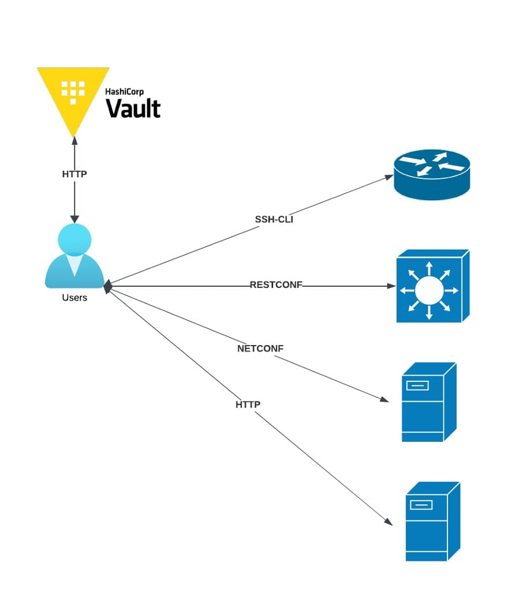

In this post, I delve into the integration of HashiCorp Vault into your network automation pipelines and workflows. This comprehensive guide is divided into five parts:

1.  Building and configuring your own Vault on Docker Container
2.  Basic Vault operations via Vault CLI
3.  Creating Python code with the HVAC library
4.  Interaction between Netmiko and Vault
5.  Running a container from a GitHub clone

Part 5 provides a quick method to get your container up and running by cloning the [GitHub repository](https://github.com/melihteke/vault). If you're eager to get started quickly, feel free to jump straight to Part 5. However, for a thorough understanding of the process, I recommend going through all the parts sequentially.

### Part 1: Building and Configuring Your Own Vault in Docker Container

**Step:1** Make sure docker is installed on your system. If it not installed, please visit this [web site](https://docs.docker.com/engine/install/) and follow the instructions applicable to your host system.

**Step-2**: Create your application directory by executing the following command:

```shell
mkdir -p vault/config
```

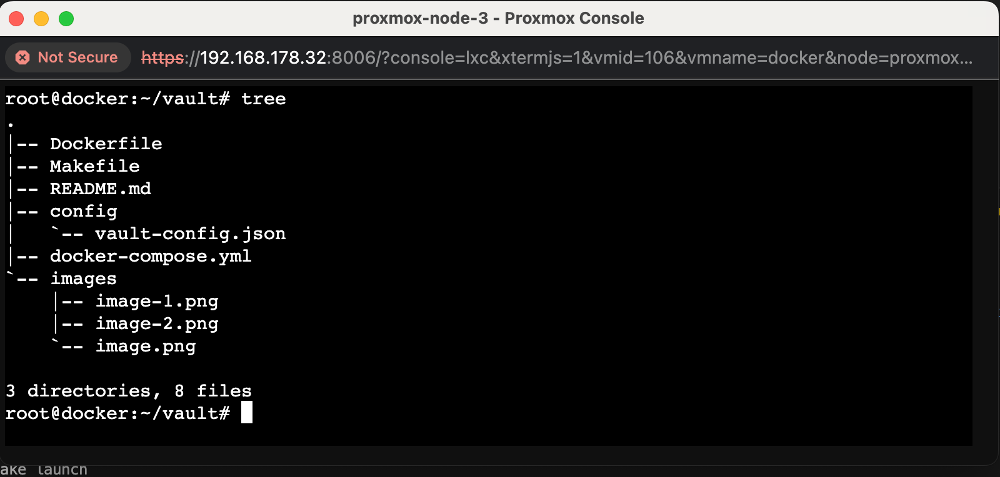

This command will create a 'vault' directory, with a nested 'config' directory.

**Step-3:** Proceed to create the Vault configuration file, named `vault-config.json`.

```json
vim vault/config/vault-config.json

{
    "backend": {
      "file": {
        "path": "vault/data"
      }
    },
    "listener": {
      "tcp":{
        "address": "0.0.0.0:8200",
        "tls_disable": 1
      }
    },
    "ui": true,
    "disable_mlock" : true  # You might delete this line !!!
  }
```

```shell
root@docker:~/vault# tree
.
|-- Dockerfile
|-- Makefile
|-- README.md
|-- config
|   `-- vault-config.json
|-- docker-compose.yml
|-- images
|   |-- image-1.png
|   |-- image-2.png
|   `-- image.png
`-- run.sh

3 directories, 9 files
```

The `disable_mlock` option in the Vault configuration file is used to control the use of the `mlock` system call.

By default, Vault uses `mlock` to prevent memory from being swapped to disk. This is a security feature that helps to ensure that sensitive information (like your Vault data) doesn't get written to disk where it could be accessed by unauthorized users.

Setting `"disable_mlock" : true` in your configuration file disables this feature. This might be necessary in certain environments where the `mlock` system call isn't allowed, but it does mean that your Vault data could potentially be written to disk.

It's generally recommended to leave `mlock` enabled (i.e., `disable_mlock` set to `false`) if possible, especially in production environments.

**Step-4:** Proceed to create a [`docker-compose.yml`](https://github.com/melihteke/vault/blob/master/docker-compose.yml) file within the `vault/` directory. Ensure that Docker Compose is installed on your system. If it isn't, please visit the provided [site](https://docs.docker.com/compose/install/linux/) for installation instructions. .

```Dockerfile
version: '3.8'

services:
  vault-filesystem:
    image: mteke/vault-filesystem:0.1
    ports:
      - 8200:8200
    environment:
      - VAULT_ADDR=http://127.0.0.1:8200
      - VAULT_API_ADDR=http://127.0.0.1:8200
    command: server -config=/vault/config/vault-config.json
    cap_add:
      - IPC_LOCK
```

-   `version: '3.8'`: This specifies the version of Docker Compose file format that you're using.
-   `services:`: This section defines the services (containers) that should be created.
-   `vault-filesystem:`: This is the name of the service.
-   `image: mteke/vault-filesystem:0.1`: This specifies the Docker image to use for this service.
-   `ports:`: This section maps ports between the container and the host machine. In this case, port 8200 on the host is mapped to port 8200 on the container.
-   `environment:`: This section defines environment variables for the service. Here, `VAULT_ADDR` and `VAULT_API_ADDR` are both set to `http://127.0.0.1:8200`.
-   `command: server -config=/vault/config/vault-config.json`: This is the command that will be run when the container starts.
-   `cap_add:`: This section allows you to add Linux capabilities. Here, `IPC_LOCK` is added, which allows the process to lock memory, preventing sensitive information from being written to disk.

**Step-5**: Proceed to construct your Docker image. To do this, create a [`Dockerfile`](https://github.com/melihteke/vault/blob/master/Dockerfile) within the `vault/` directory. You can use the `vim` editor for this purpose:

```shell
root@docker:~/vault# vim vault/Dockerfile
```

```Dockerfile
#Dockerfile

# base image
FROM alpine:3.14

# set vault version
ENV VAULT_VERSION 1.8.2

# create a new directory
RUN mkdir /vault

# download dependencies
RUN apk --no-cache add \
      bash \
      ca-certificates \
      wget \
      curl

# download and set up vault
RUN wget --quiet --output-document=/tmp/vault.zip https://releases.hashicorp.com/vault/${VAULT_VERSION}/vault_${VAULT_VERSION}_linux_amd64.zip && \
    unzip /tmp/vault.zip -d /vault && \
    rm -f /tmp/vault.zip && \
    chmod +x /vault

# update PATH
ENV PATH="PATH=$PATH:$PWD/vault"

# add the config file
COPY ./config/vault-config.json /vault/config/vault-config.json

# expose port 8200
EXPOSE 8200

# run vault
ENTRYPOINT ["vault"]
```

-   `FROM alpine:3.14`: This sets the base image for the Docker container. Alpine Linux is a lightweight Linux distribution.
-   `ENV VAULT_VERSION 1.8.2`: This sets an environment variable `VAULT_VERSION` to `1.8.2`.
-   `RUN mkdir /vault`: This creates a new directory `/vault` in the Docker image.
-   `RUN apk --no-cache add ...`: This installs the necessary dependencies in the Docker image using Alpine's package manager `apk`.
-   `RUN wget --quiet ...`: This downloads the Vault binary for the version specified in `VAULT_VERSION`, unzips it into the `/vault` directory, removes the zip file, and makes the Vault binary executable.
-   `ENV PATH="PATH=$PATH:$PWD/vault"`: This adds the `/vault` directory to the `PATH`, so the `vault` command can be run from any location.
-   `COPY ./config/vault-config.json /vault/config/vault-config.json`: This copies the local file `./config/vault-config.json` into the image's `/vault/config/vault-config.json`.
-   `EXPOSE 8200`: This tells Docker that the container will listen on the specified network ports at runtime. Here it's port 8200, which is the default port for Vault.
-   `ENTRYPOINT ["vault"]`: This configures the container to run as an executable. The `vault` command will be run when a container is launched from this image.

Build your Docker image by executing the following command:

```shell
root@docker:~/vault# docker build -t mteke/vault-filesystem:0.1 .
```

Upon successful creation of the image, you can verify its existence using the `docker images` command.

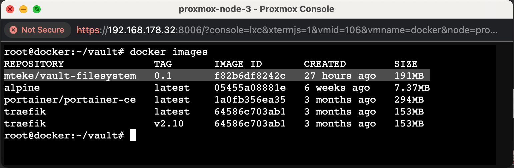

**Step-6:** Launch the container by executing the following command:

```shell
root@docker:~/vault# docker-compose up -d vault-filesystem
```

This command will start the `vault-filesystem` service as defined in your `docker-compose.yml` file, and the `-d` option will run it in detached mode, meaning it will run in the background.

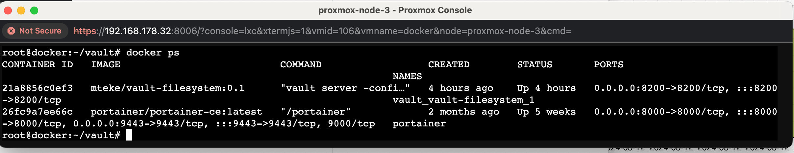

The container is now active and its services are accessible via TCP port 8200 on the host machine. The next step involves logging into the container to complete the remaining tasks.

**Step-7:** To attach to the running container, execute the following command:

```shell
root@docker:~/vault# docker exec -it 21a8856c0ef3 /bin/sh
```

This command will start an interactive shell session (`/bin/sh`) inside the container with ID `21a8856c0ef3`. Please replace `21a8856c0ef3` with the actual ID of your running container.

You can also attach to the running container using the image name. Execute the following command:

```shell
root@docker:~/vault# docker exec -it mteke/vault-filesystem:0.1 /bin/sh
```

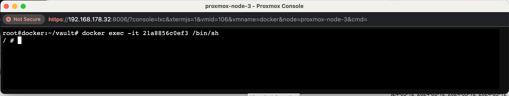

**Step-8:** The initial attachment to the Vault requires a specific process, which is only necessary the first time.

Please note that the Vault container referenced in this guide has already been deleted. Consequently, any tokens displayed beyond this point are no longer valid. Always ensure the security of your tokens and never share them with anyone !!

```shell
/ # vault status
Key                Value
---                -----
Seal Type          shamir
Initialized        false
Sealed             true
Total Shares       0
Threshold          0
Unseal Progress    0/0
Unseal Nonce       n/a
Version            1.8.2
Storage Type       file
HA Enabled         false
/ # vault operator init
Unseal Key 1: zECDUPUh++oqx6dC0jKpQKPZttxJb+jVYn/9/DyJ0pUK
Unseal Key 2: 0Rawi7WxcQOK6w5mNYde03KjrtZoXWH5EdvBP/NZ9CGk
Unseal Key 3: E8VECbOQ/posqMF5W3tn+1SpPHauvabI1Kffhp9ONRIF
Unseal Key 4: XqdqW1cGq2D9NKdjE8ctQzmA4E9lHjEfv7tOeN0Uoxju
Unseal Key 5: FeJN3I+fU+QnzQFnGWlf9C5RLl6dN8S1sQYbLM8D4vav

Initial Root Token: s.UhudItkyEoBQl31yg1hLQ31i

Vault initialized with 5 key shares and a key threshold of 3. Please securely
distribute the key shares printed above. When the Vault is re-sealed,
restarted, or stopped, you must supply at least 3 of these keys to unseal it
before it can start servicing requests.

Vault does not store the generated master key. Without at least 3 keys to
reconstruct the master key, Vault will remain permanently sealed!

It is possible to generate new unseal keys, provided you have a quorum of
existing unseal keys shares. See "vault operator rekey" for more information.
/ # 
/ # 
```

**Step-9:** Unseal the tokens 5 times

```shell
/ # vault operator unseal
Unseal Key (will be hidden): 
Key                Value
---                -----
Seal Type          shamir
Initialized        true
Sealed             true
Total Shares       5
Threshold          3
Unseal Progress    1/3
Unseal Nonce       c3685ac4-1ba6-f8dc-bc7d-36cdc51dc697
Version            1.8.2
Storage Type       file
HA Enabled         false
/ # vault operator unseal
Unseal Key (will be hidden): 
Key                Value
---                -----
Seal Type          shamir
Initialized        true
Sealed             true
Total Shares       5
Threshold          3
Unseal Progress    2/3
Unseal Nonce       c3685ac4-1ba6-f8dc-bc7d-36cdc51dc697
Version            1.8.2
Storage Type       file
HA Enabled         false
/ # vault operator unseal
Unseal Key (will be hidden): 
Key             Value
---             -----
Seal Type       shamir
Initialized     true
Sealed          false
Total Shares    5
Threshold       3
Version         1.8.2
Storage Type    file
Cluster Name    vault-cluster-ca26eabb
Cluster ID      6f058db8-2ada-c626-dd14-0ccafd91ee98
HA Enabled      false
/ # 
/ # 
/ # vault operator unseal
Unseal Key (will be hidden): 
Key             Value
---             -----
Seal Type       shamir
Initialized     true
Sealed          false
Total Shares    5
Threshold       3
Version         1.8.2
Storage Type    file
Cluster Name    vault-cluster-ca26eabb
Cluster ID      6f058db8-2ada-c626-dd14-0ccafd91ee98
HA Enabled      false
/ # 
/ # 
/ # vault operator unseal
Unseal Key (will be hidden): 
Key             Value
---             -----
Seal Type       shamir
Initialized     true
Sealed          false
Total Shares    5
Threshold       3
Version         1.8.2
Storage Type    file
Cluster Name    vault-cluster-ca26eabb
Cluster ID      6f058db8-2ada-c626-dd14-0ccafd91ee98
HA Enabled      false
/ # 
```

**Step-10:** Now, it's time to log into your Vault using the Vault Command Line Interface (CLI).

```shell
/ # vault login
Token (will be hidden): 
Success! You are now authenticated. The token information displayed below
is already stored in the token helper. You do NOT need to run "vault login"
again. Future Vault requests will automatically use this token.

Key                  Value
---                  -----
token                s.UhudItkyEoBQl31yg1hLQ31i
token_accessor       1PwQoXyHa9icdNVmzfiHNHPM
token_duration       ∞
token_renewable      false
token_policies       ["root"]
identity_policies    []
policies             ["root"]
/ # 
```

### Part 2: Vault GUI and CLI Operations

Now that your Vault server is operational, you can begin executing basic operations using both the Graphical User Interface (GUI) and the Command Line Interface (CLI).

**Step-1: Connect Vault GUI**

```shell
http://<host-device-ip-address>:8200/
```

To connect to the Vault GUI, you'll need to use your token. In your case, you would log in using the token `s.UhudItkyEoBQl31yg1hLQ31i`.

Please note that tokens are sensitive information and should be kept secure. Do not share your tokens publicly.

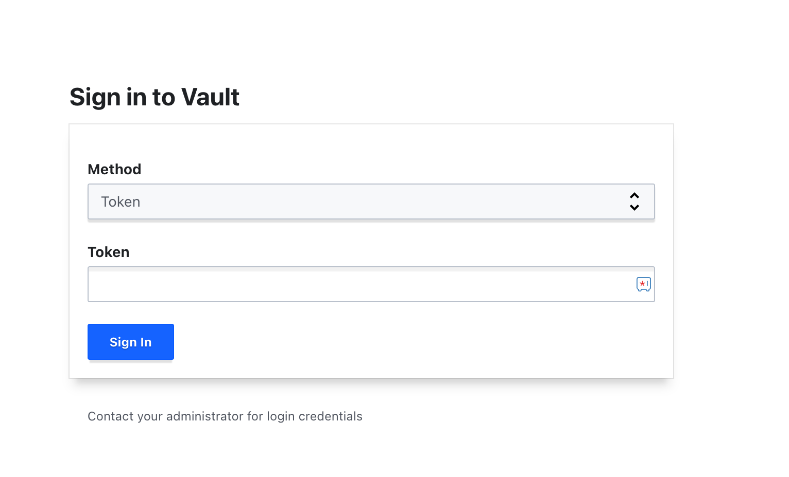

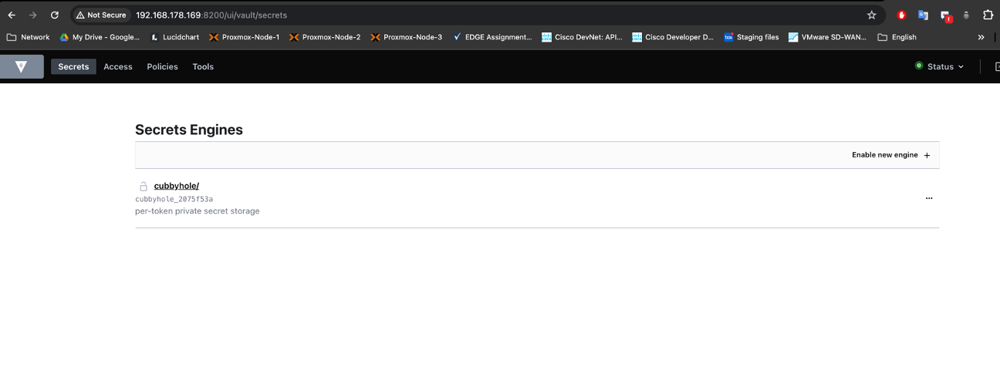

**Step-2:** Create a new vault path

Creating a path in Vault is part of setting up a secrets engine. In this case, I have created a v1 Key-Value (KV) secrets engine at the path `netdevops`. Here's a general guide on how to do this:

Check out this [official documentation](https://hvac.readthedocs.io/en/stable/usage/secrets_engines/kv.html#) for other option.

```shell
/ # vault secrets enable -path=netdevops -version=1 kv
Success! Enabled the kv secrets engine at: netdevops/
/ #
```

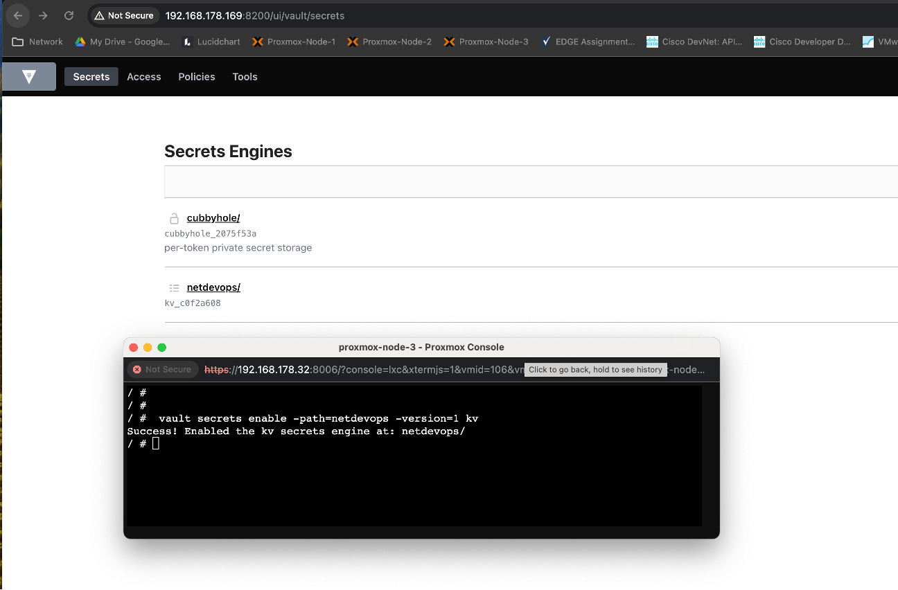

**Step-3:** To create new secrets in Vault, you can use the `vault kv put` command. In your case, to create `AD_USERNAME` and `AD_PASSWORD` secrets under the `netdevops` path, you would do:

```shell
/ #  vault kv put netdevops/AD_USERNAME data=globaluser
Success! Data written to: netdevops/AD_USERNAME
/ # 
/ # 
/ #  vault kv put netdevops/AD_PASSWORD data=N1C3P@SSW0RD
Success! Data written to: netdevops/AD_PASSWORD
/ #
```

```shell
vault kv put netdevops/AD_USERNAME value=<your-username>
vault kv put netdevops/AD_PASSWORD value=<your-password>
```

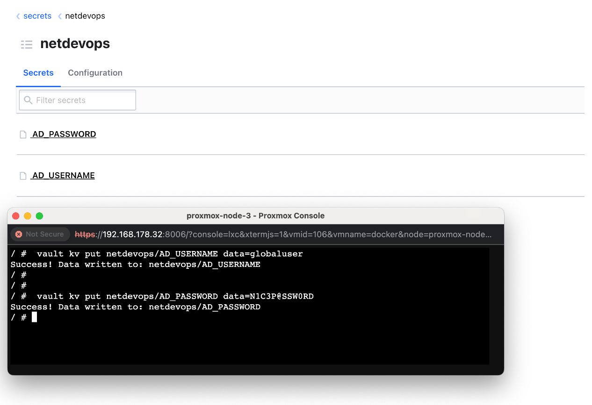

You can verify the content of the secret by comparing the output from the Command Line Interface (CLI) and the Graphical User Interface (GUI). This ensures that the secret was correctly stored and can be accurately retrieved.

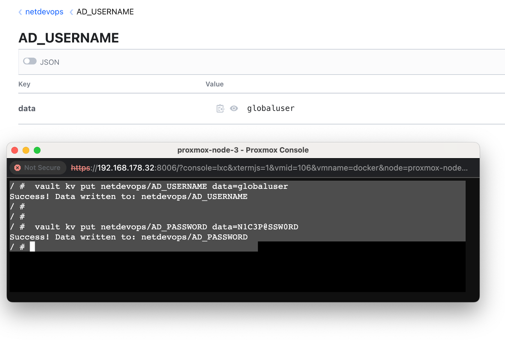

Yes, you can retrieve secrets from Vault in JSON format by checking Web GUI.

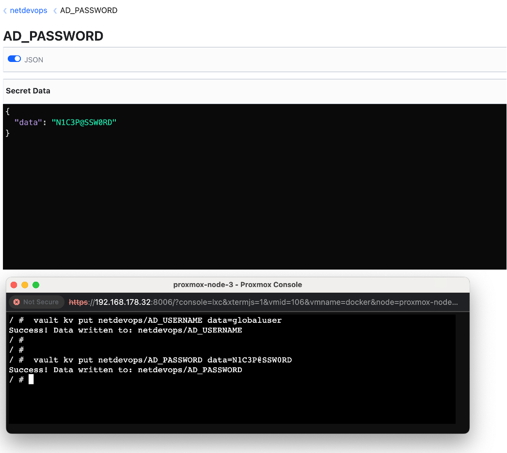

**Step-4:** To retrieve secret values from the Vault using the Command Line Interface (CLI), you can use the `vault kv get` command.

For example, if you have a secret stored at the path `netdevops/AD_USERNAME`, you can retrieve it with:

```shell
/ # vault kv get netdevops/AD_USERNAME
==== Data ====
Key     Value
---     -----
data    globaluser
/ # 
/ # 
/ # vault kv get netdevops/AD_PASSWORD
==== Data ====
Key     Value
---     -----
data    N1C3P@SSW0RD
/ # 
```

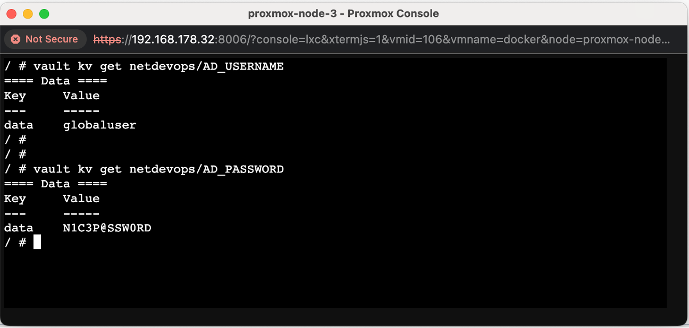

**Step-5:** To retrieve secret values from Vault using cURL, you can make a GET request to the Vault API. You'll need to include your Vault token in the `X-Vault-Token` header.

Here's an example of how to retrieve a secret using cURL:

```curl

##AD_PASSWORD
/ # curl \
>     -H "X-Vault-Token: s.UhudItkyEoBQl31yg1hLQ31i" \
>     -X GET \
>     http://127.0.0.1:8200/v1/netdevops/AD_PASSWORD


{"request_id":"1dbe04d1-37a2-6dd4-cc72-8bb90c1c5a9a",
"lease_id":"",
"renewable":false,
"lease_duration":2764800,
"data":{"data":"N1C3P@SSW0RD"},
"wrap_info":null,
"warnings":null,
"auth":null}


## AD_USERNAME
/ # curl \
>     -H "X-Vault-Token: s.UhudItkyEoBQl31yg1hLQ31i" \
>     -X GET \
>     http://127.0.0.1:8200/v1/netdevops/AD_USERNAME


{"request_id":"924b147a-49cd-3738-17b7-472e59be9633",
"lease_id":"",
"renewable":false,
"lease_duration":2764800,
"data":{"data":"globaluser"},
"wrap_info":null,
"warnings":null,
"auth":null}
/ #
```

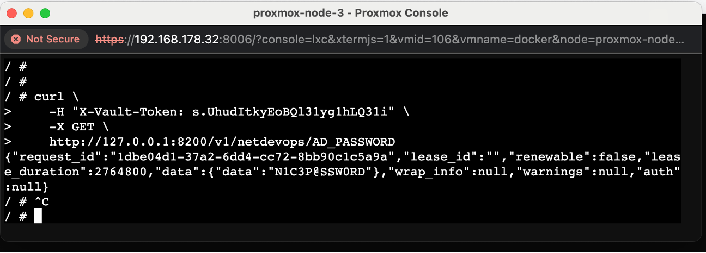

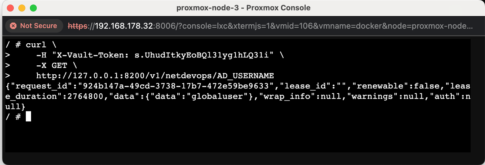

**Step-6:** To add a new secret to Vault using cURL, you can make a POST request to the Vault API. You'll need to include your Vault token in the `X-Vault-Token` header and provide the secret data in the request body.

Here's an example of how to add a new secret using cURL:

_MERAKI\_PASSWORD=M3R@K1_

```curl
/ # curl \
>     -H "X-Vault-Token: s.UhudItkyEoBQl31yg1hLQ31i" \
>     -H "Content-Type: application/json" \
>     -X POST \
>     -d '{ "data": { "data": "M3R@K1" } }' \
>     http://192.168.178.169:8200/v1/netdevops/MERAKI_PASSWORD
```

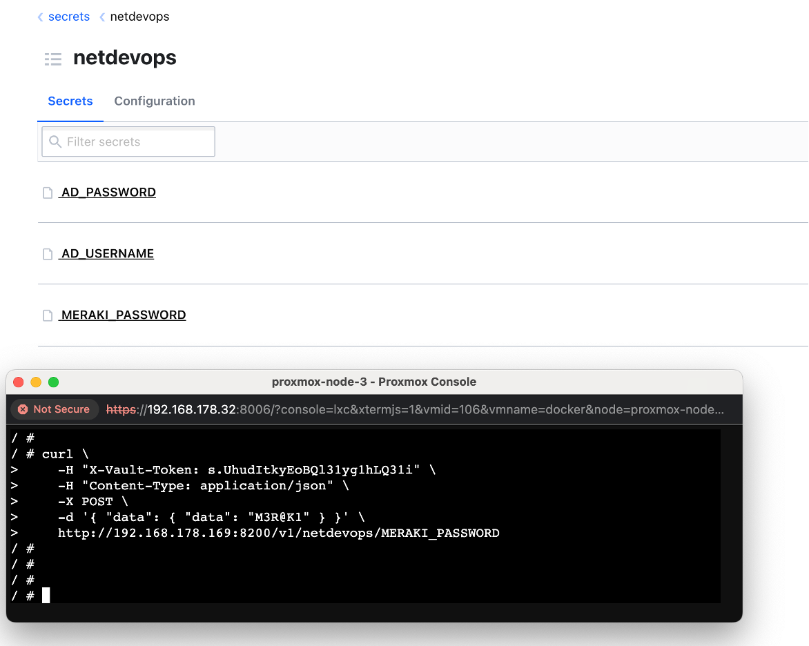

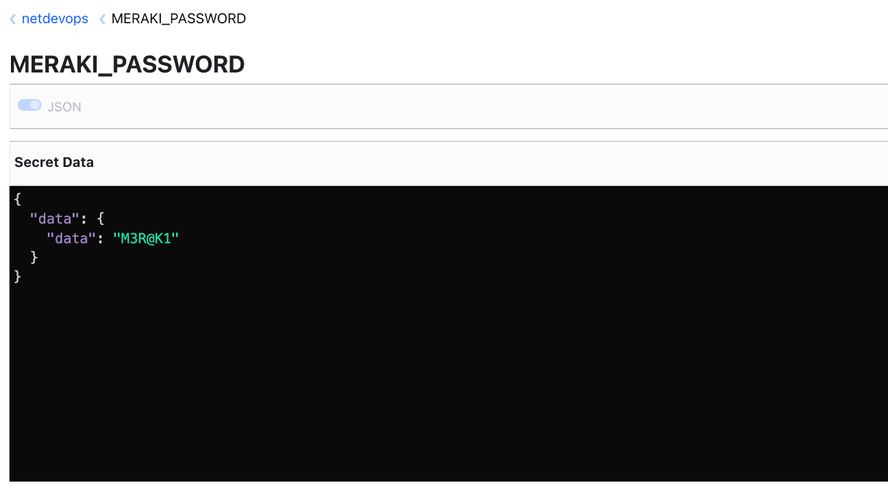

### Part 3: Using the HVAC Library with Python

To install the HVAC library, which is a Python client for interacting with HashiCorp Vault, you can use pip, the Python package installer. Run the following command in your terminal:

**Step-1:** First, install the HVAC library with 

```shell
pip install hvac
```

**Step-2:** Sample configuration for hvac library

To retrieve the `netdevops/AD_PASSWORD` secret from Vault and output the response in dict data type using Python and the HVAC library, you can use the following code:

```python
import hvac

# Create a client object
client = hvac.Client(
    url='http://192.168.178.169:8200',
    token='s.UhudItkyEoBQl31yg1hLQ31i'
)

# execute read_secret method
client.secrets.kv.v1.read_secret(mount_point="netdevops", path="AD_PASSWORD")


Out[2]: 
{'request_id': '698a9137-85b2-6b72-7f65-7f55338ebc45',
 'lease_id': '',
 'renewable': False,
 'lease_duration': 2764800,
 'data': {'data': 'N1C3P@SSW0RD'},
 'wrap_info': None,
 'warnings': None,
 'auth': None}
```

To view the `netdevops/AD_PASSWORD` secret in the Vault web GUI:

1.  Open your Vault GUI in a web browser.
2.  Navigate to the `netdevops` secrets engine.
3.  Click on the `AD_PASSWORD` secret.
4.  The secret's value will be displayed on the right side of the screen, typically in a JSON-like format.

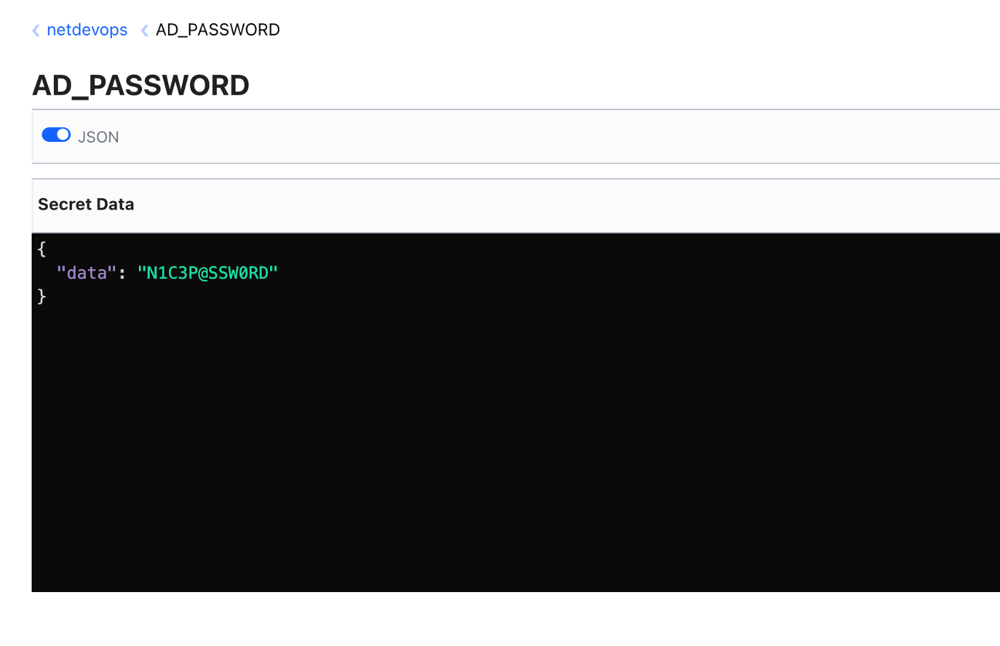

**Step-3: How to write / update KV in Vault**

To programmatically create or update a secret in Vault using Python and the HVAC library, you can use the `create_or_update_secret` method. Here's an example:

```python
In [4]:new_secret = {"data": "THIS IS MORE SECURE SECRET"}

In [5]:client.secrets.kv.v1.create_or_update_secret(mount_point="netdevops", path="PYTHON_SECRET", secret=new_secret)
   ...: 
Out[5]: <Response [204]>
```

HTTP 204 is a status code that means "No Content". In the context of a Vault operation, it typically means that the operation was successful but there's no additional content to return in the response body.

If you're seeing this status code after running a `create_or_update_secret` operation, it means the secret was successfully created or updated.

You can verify this by checking the GUI view. Navigate to the `netdevops` secrets engine and click on the `PYTHON_SECRET` secret. If the operation was successful, you should see the new or updated value for this secret.

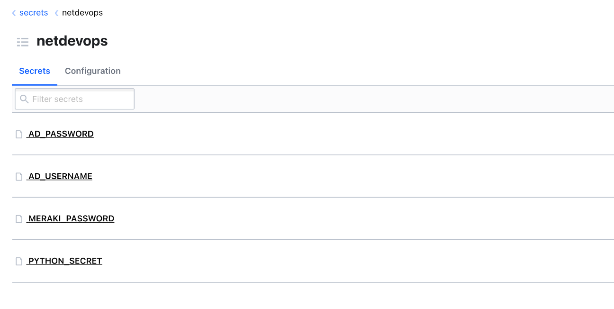

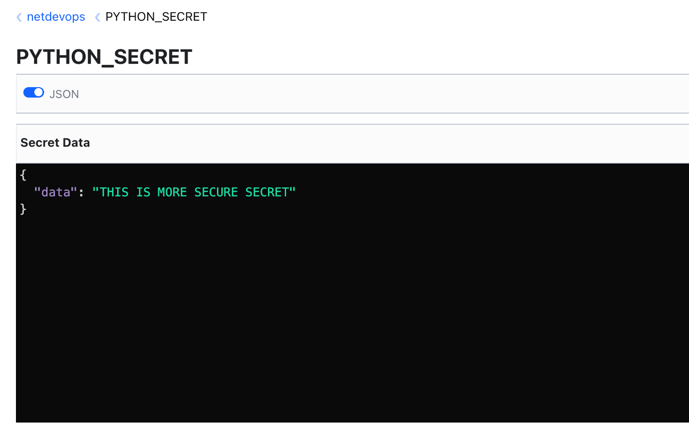

### Part 4: Interaction Between Netmiko and Vault

Here's a basic script that uses Netmiko to interact with a network device, with the device credentials stored in HashiCorp Vault:

Install hvac and netmiko libraries.

```shell
pip install --upgrade pip
pip install netmiko hvac
```

```python
from netmiko import ConnectHandler

def get_kv_secret(mount_point, path):
    import hvac
    client = hvac.Client(
    url='http://192.168.178.169:8200',
    token='s.UhudItkyEoBQl31yg1hLQ31i')
    return client.secrets.kv.v1.read_secret(mount_point=mount_point, path=path)['data']['data']

# Retrieve kv secrets from vault and assign them to variable
username = get_kv_secret(mount_point="netdevops", path="AD_USERNAME")
password = get_kv_secret(mount_point="netdevops", path="AD_PASSWORD")

device = {
    'device_type': 'cisco_ios',
    'ip':   '10.0.0.1',
    'username': username,
    'password': password,
}

# Create a connection instance
connection = ConnectHandler(**device)

# Execute send_command method
output = connection.send_command('show ip int brief')

# Print the output of the command
print(output)

# Close the connection
connection.disconnect()
```

Adding the Vault token directly in your code is not a secure way. A better approach would be to use environment variables to store sensitive information like the Vault token. Here's how you can modify your function to use an environment variable for the token.

```shell
root@docker:~/vault# touch .env
root@docker:~/vault# echo "VAULT_TOKEN=s.UhudItkyEoBQl31yg1hLQ31i" >> .env
root@docker:~/vault# pip install python-dotenv
```

```python
import os
from dotenv import load_dotenv
import hvac

# Load the .env file. Make sure the file exists in the same directory. 
load_dotenv()

def get_kv_secret(mount_point, path):
    token = os.getenv('VAULT_TOKEN')
    client = hvac.Client(
        url='http://192.168.178.169:8200',
        token=token
    )
    return client.secrets.kv.v1.read_secret(mount_point=mount_point, path=path)['data']['data']
```

### Part 5: Run Container from Github Clone

If you've made it this far, I have a surprise for you. You can easily get everything up and running in just a few minutes. Simply clone my repository and execute the provided Make commands. You'll see it spring to life in no time.


* * *

### References

[https://medium.com/rahasak/run-hashicorp-vault-on-docker-with-filesystem-and-consul-backends-a67a7c958e02](https://medium.com/rahasak/run-hashicorp-vault-on-docker-with-filesystem-and-consul-backends-a67a7c958e02)

[https://hvac.readthedocs.io/en/stable/usage/secrets\_engines/kv.html#](https://hvac.readthedocs.io/en/stable/usage/secrets_engines/kv.html#)
