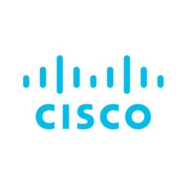

In this blog post, I will guide you through a Python script that automates the onboarding and configuration of a Cisco device using the Cisco DNA Center SDK ([`dnacentersdk`](https://pypi.org/project/dnacentersdk/)). Cisco DNA Center, now known as Cisco Catalyst Center, provides a comprehensive platform for network management and automation. The objective was to configure Cisco C9300 switches using the Plug and Play (PnP) process and automate this task. This post aims to share the insights and lessons learned during my development phase.

I will demonstrate how to claim a device, retrieve device information, deploy a configuration template, and effectively use key SDK methods. While I will focus on a few methods relevant to my specific application, there are many more methods available in Cisco's official `dnacentersdk` [documentation](https://dnacentersdk.readthedocs.io/en/latest/api/api.html#user-api-doc). I will share all the references later in this post.  

### Prerequisites

Before running the script, ensure you have the following:

-   Cisco DNA Center SDK and python-dotenv installed (**pip install dnacentersdk python-dotenv**)
-   A .env file with your Cisco DNA Center credentials:

```python
DNAC_URL=https://your-dnac-url
DNAC_USERNAME=your-username
DNAC_PASSWORD=your-password
```

-   Your Cisco device should obtain an IP address from a DHCP server pool configured with option 43. The format for option 43 should be as follows:

```bash
  Option 43
  Data Type: Text
  Value: 5A1N;B2;K4;I<CATALYST-CENTER-IP-ADDRESS;J80;
```

-   All existing PNP profiles and VLAN data need to be deleted. Perform a factory reset on the target device.

```bash
config terminal
no pnp profile pnp-zero-touch
no crypto pki certificate pool
y
config-register 0x2102
end
delete /force vlan.dat
delete /force nvram:*.cer
delete /force stby-nvram:*.cer
delete /force flash-3:vlan.dat
delete /force flash-2:vlan.dat
delete /force flash:vlan.dat
delete /force /recursive flash:pnp*
delete /force /recursive flash-2:pnp*
delete /force /recursive flash-3:pnp*
write erase 
reboot
n
```


💡

There is also a Catalyst/DNA Center discovery method available; however, I will not cover that in this post. With the correct DHCP configuration, the new device should immediately appear in the Unclaimed List of Catalyst/DNA Center under ****Provision > Plug and Play > Unclaimed**** menu.

### Initializing the Cisco DNA Center API Client

Creating DNAC Instance: Load environment variables and initialize the Cisco DNA Center API client. This instance will be used to interact with the DNA Center APIs.

```python
import os
from dotenv import load_dotenv
from dnacentersdk import api

# Load environment variables from .env file
load_dotenv()

DNAC_URL = os.getenv('DNAC_URL')
DNAC_USERNAME = os.getenv('DNAC_USERNAME')
DNAC_PASSWORD = os.getenv('DNAC_PASSWORD')

# Initialize Cisco DNA Center API client instance
dnac = api.DNACenterAPI(base_url=f'{DNAC_URL}:443',
                        username=f'{DNAC_USERNAME}',
                        password=f'{DNAC_PASSWORD}', 
                        verify=False)
```

### Devices Methods

Device methods are related to managing devices in the Cisco DNA Center Inventory. Here are some key methods:

To retrieve the device count in DNA Center.

```python
dnac.devices.get_device_count()
{'response': 11097, 'version': '1.0'}
```

To retrieve device list

```python
dnac.devices.get_device_list()
```

💡

The `get_device_list()` method includes an offset parameter and retrieves only the first 500 devices by default.

  
To collect all the devices, you can use the following function:

```python
device_count = dnac.devices.get_device_count()["response"]

def get_all_the_devices_from_dnac():
    device_list = []
    for offset in range(1, device_count, 500):
        device_list.extend(dnac.devices.get_device_list(offset=offset)["response"])
    return device_list
```

### Site Methods

Site methods are used for managing sites in the Cisco DNA Center Inventory. Here are some key methods:

To retrieve the site count in DNA Center.

```python
In [14]: dnac.sites.get_site_count()
Out[14]: {'response': 1129, 'version': '1.0'}
```

To retrieve site list.

```python
dnac.sites.get_site()
```

Create a site

```python
site_data = {
 "type": "building",
 "site": {
  "area": {
   "name": "Branch 48",
   "parentName": "Global"
  },
  "building": {
   "name": "High Space",
   "parentName": "Global/Branch 48",
   "address": "Mugla, Turkiye"
  }
 }
}

dnac.sites.create_site(payload=site)
```

###   
Device Onboarding PNP Method

Device Onboarding PNP methods are used to onboard new devices and add them to the Cisco DNA Center inventory list. Here are some key methods:

To view all devices in the Unclaimed state

```python
dnac.device_onboarding_pnp.get_device_list(state='Unclaimed')
```

To view all devices in the Planned State

```python
dnac.device_onboarding_pnp.get_device_list(state='Planned')
```

To view all devices in the Onboarding State

```python
dnac.device_onboarding_pnp.get_device_list(state='Onboarding')
```

### Configuration Template Method

To retrieve configuration templates. From this output, you will need the `configId` for claiming the device.

```python
dnac.configuration_templates.gets_the_templates_available()
```

### Software Image Management SWIM Method

To retrieve software images. From this output, you will need the `imageId` for claiming the device.

```python
dnac.software_image_management_swim.get_software_image_details()
```

### Device Onboarding PNP Claim device Method

An onboarding template includes only the basic configuration of the device. In this example, I will use a very simple template to demonstrate the concept. You can create this template in **Design > CLI Templates** or **Tools > Template Hub**.

```python
onboarding.j2
hostname {{ hostname }}
```

```python
config_params =[{'key': 'hostname', 'value': 'test-device'}]
skip_ios_upgrade= True
deviceId=dnac.device_onboarding_pnp.get_device_list(state='Unclaimed')[0]['id']
dnac.device_onboarding_pnp.claim_a_device_to_a_site(deviceId=deviceId,
                                                    siteId="78c77a12-988c-4cde-86a2-457456123448dc39",
                                                    type='Default',
                                                    imageInfo={
                                                               "imageId": "dfb4dc-e440-4450-9155-4561294544f978",
                                                               "skip": skip_ios_upgrade
                                                                        },
                                                    configInfo={
                                                                "configId": "6a42ed26-c221-4701-b384-45612eef61989",
                                                                "configParameters": config_params
                                                                        })
```

💡

****siteId**** can be obtained from ****dnac.sites.get\_site()****  
****imageId**** can be obtained from ****dnac.software\_image\_management\_swim.get\_software\_image\_details()****  
****configId**** can be obtained from ****dnac.configuration\_templates.gets\_the\_templates\_available()****  
****skip**** is a boolean value. Set it to `True` if you want to skip the software upgrade during the claim operation. If set to `False`, DNA Center will upgrade the device with the Golden Tagged image, which can be found in the Image Repository. ****Design > Image Repository****

### Configuration Templates Deploy Template Method

The deploy template method is used to apply a specific configuration to a destination device that is already in the DNAC inventory list.

```jinja2
provision.j2
ip access-list standard DNAC-TEST
permit 192.168.178.1 0.0.0.0 log
```

```python
device_id = "1c2340ce-40de-4781-2452-0323423457b4eef"

params = {
            "access-list": "added",
}
templateId ="c4544da37-e120-4abb-b65a-456122bacdfc9"
result = dnac.configuration_templates.deploy_template_v2(forcePushTemplate=True,
                                                targetInfo=[{
                                                             "id": device_id,
                                                             "type": "MANAGED_DEVICE_UUID",
                                                             "params": params
                                                                 }],
                                                templateId=templateId)

task_id = result.response.taskId

dnac.task.get_task_by_id(task_id=task_id)
```

💡

****device\_id**** can be obtained from ****dnac.devices.get\_device\_list()****  
****templateId**** can be obtained from ****dnac.configuration\_templates.gets\_the\_templates\_available()****

### Command Runner Method

The Command Runner method is used to execute commands through Cisco DNA Center. You can see all the available commands using the following code:

```python
commands = dnac.command_runner.get_all_keywords_of_clis_accepted()
```

If you compare the code with this flow, you will likely understand it much more easily. Initially, it may seem a bit complicated to run a simple command, but once you understand the flow high level, it is much more make sense what you see in the code.


To run a command, use the code below:

```python
In [95]: run_cmd = dnac.command_runner.run_read_only_commands_on_devices(commands=["show run"],deviceUuids=[id])

In [97]: run_cmd
Out[97]: 
{'response': {'taskId': 'dc4561241d-e897-4752-a483-38bcdb1b4fb1',
  'url': '/api/v1/task/dc4561241d-e897-4752-a483-38bcdb1b4fb1'},
 'version': '1.0'}
 
```

To get task information, use the following code:

```python
In [98]: task_info = dnac.task.get_task_by_id(run_cmd.response.taskId)

In [99]: task_info
Out[99]: 
{'response': {'version': 1730123449388,
  'startTime': 1730731048808,
  'progress': '{"fileId":"b612343d-4a28-4261-8d5f-424843810462"}',
  'endTime': 1730731049388,
  'serviceType': 'Command Runner Service',
  'username': 'test-admin',
  'lastUpdate': 1730731049388,
  'isError': False,
  'instanceTenantId': '617c3e12342a13f022cf92c',
  'id': 'dc3e241d-e897-4752-1234-38bcdb1b4fb1'},
 'version': '1.0'}


In [100]: task_progress = task_info.response.progress

In [101]: task_progress
Out[101]: '{"fileId":"b612343d-4a28-4261-8d5f-424843810462"}'

task_progress= json.loads(task_progress)
cmd_output = dnac.file.download_a_file_by_fileid(task_progress['fileId'])

# This show the response
cmd_output.data
```

This is the flow for using the Command Runner method you can find below. For more details, you can also refer to Kareem Iskander's [blog post](https://blogs.cisco.com/developer/network-automation-cisco-dna-center-sdk-2), which is listed in my reference section.

In conclusion, there are many more methods available in this SDK. However, as mentioned at the beginning, I focused on sharing those relevant to my task of claiming a device and configuring it using configuration templates. I hope you it is informative for you. Thank you for reading !

* * *

### References

I have been reading the following pages, which serve as my references. You can also check these references.





I also did some reverse engineering with code from my friend [Bogdan Radu](https://www.linkedin.com/in/bogdan-radu-9b710314/). You can visit his LinkedIn profile for more information about him.
