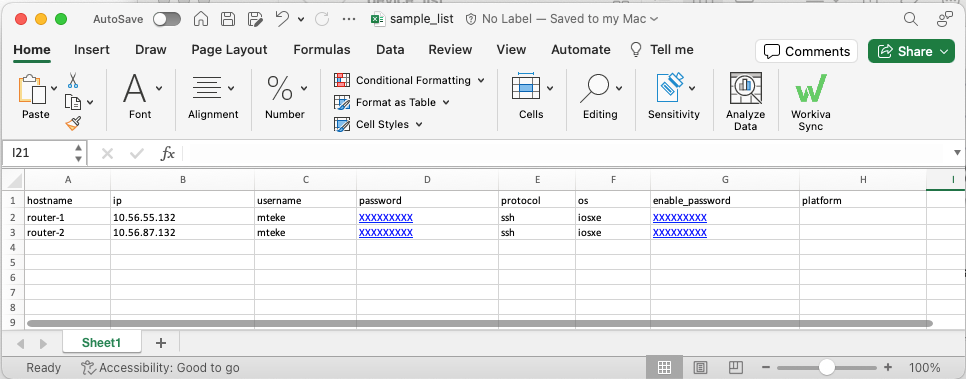

In the world of network automation and testing, PyATS stands out as a powerful, versatile tool. Developed by Cisco, PyATS (Python Automated Test System) is an open-source, Python-based library designed to help engineers automate their network testing and validation.

### What is PyATS?

PyATS is a lightweight, multi-threaded, multiprocess network automation framework that aids in the efficiency of network testing. It provides a set of tools and libraries that help engineers automate all aspects of network testing in their development cycle, from functional to regression testing.

### Key Features of PyATS

1.  **Modular and Flexible:** PyATS is designed to be modular and flexible, allowing engineers to use only the components they need. It can be integrated with other Python libraries and tools, making it a versatile choice for network automation.
2.  **Robust Testing Capabilities:** PyATS provides a robust testing infrastructure, including capabilities for test case management, reporting, and logging. It supports both positive and negative testing.
3.  **Network State Validation:** With PyATS, engineers can capture and compare network states before and after making changes. This helps in validating the impact of changes and aids in troubleshooting.

In this blog post, I'll guide you through the process of leveraging PyATS for your network migrations. We'll explore how to efficiently gather pre and post-migration checks, simplifying your validation process and ensuring a smooth transition. Stay tuned to discover the power of PyATS in network automation and testing.

### Create Virtual Environment and activate

```shell
python -m venv .venv

source .venv/bin/activate
```

### Install Pyats

```shell
pip install pyats[all]
```

### Generate your Pyats private key

```shell
(.venv) MTeke@mac-2BA4 % pyats secret keygen
Newly generated key :
D43IDg5__FAKE__uKdfgdwewfIxLyA=
```

### Configure Pyats configuration file

```shell
cd .venv/
vim  pyats.conf


[secrets]
string.representer = pyats.utils.secret_strings.FernetSecretStringRepresenter
string.key = D43IDg5__FAKE__uKdfgdwewfIxLyA=
```

💡

We configure Pyats with generated key.

## How to Generate testbed.yaml file

### Create XLSX Table

This is very lazy way but it is always easy to craete simple xlsx :) The device lists are added under device\_list/ directory as a xlsx/csv format. Edit this file with all the details.



_"testbed.yaml"_ is being generated.

```shell
pyats create testbed file --path device_list/sample_list.xlsx --output testbed-files/sample_testbed.yaml --encode-password

(.venv) MTeke@mac-2BA4 % pyats create testbed file --path device_list/sample.xlsx --output testbed-files/sample_testbed.yaml --encode-password
Testbed file generated: 
device_list/sample_list.xlsx -> testbed-files/sample_testbed.yaml
```

testbed.yaml

```
devices:
  router-1:
    connections:
      cli:
        ip: 10.56.55.132
        protocol: ssh
    credentials:
      default:
        password: 
        username: mteke
      enable:
        password: 
    os: iosxe
    type: iosxe
  router-2:
    connections:
      cli:
        ip: 10.56.78.132
        protocol: ssh
    credentials:
      default:
        password: 
        username: mteke1
      enable:
        password: 
    os: iosxe
    type: iosxe
```

testbed.yaml

### Execute Prechecks

```shell
(.venv) MTeke@mac-2BA4 % pyats parse "show version" --testbed-file testbed-files/sample_testbed.yaml --output outputs/PRECHECK_RESULTS
100%|███████████████████████████████████████████████████████████████████████████████████████████████████████████████| 1/1 [00:01<00:00,  1.14s/it]
+==============================================================================+
| Genie Parse Summary for router-1                                           |
+==============================================================================+
|  Connected to router-1                                                     |
|  -  Log: outputs/PRECHECK_RESULTS/connection_router-1.txt                  |
|------------------------------------------------------------------------------|
|  Parsed command 'show version'                                               |
|  -  Parsed structure: outputs/PRECHECK_RESULTS/router-1_show-              |
| version_parsed.txt                                                           |
|  -  Device Console:   outputs/PRECHECK_RESULTS/router-1_show-              |
| version_console.txt                                                          |
|------------------------------------------------------------------------------|
```

Execute Pre Checks

### Execute PostChecks

```shell
(.venv) MTeke@mac-2BA4 % pyats parse "show version" --testbed-file testbed-files/sample_testbed.yaml --output outputs/POSTCHECK_RESULTS
100%|███████████████████████████████████████████████████████████████████████████████████████████████████████████████| 1/1 [00:01<00:00,  1.17s/it]
+==============================================================================+
| Genie Parse Summary for router-1                                           |
+==============================================================================+
|  Connected to router-1                                                    |
|  -  Log: outputs/POSTCHECK_RESULTS/connection_router-1.txt                 |
|------------------------------------------------------------------------------|
|  Parsed command 'show version'                                               |
|  -  Parsed structure: outputs/POSTCHECK_RESULTS/router-1_show-             |
| version_parsed.txt                                                           |
|  -  Device Console:   outputs/POSTCHECK_RESULTS/router-1_show-             |
| version_console.txt                                                          |
|------------------------------------------------------------------------------|
```

Execute Post Checks

### Compare Pre / Post Checks

```shell
(.venv) MTeke@mac-2BA4 % genie diff outputs/PRECHECK_RESULTS outputs/POSTCHECK_RESULTS 
1it [00:00, 758.74it/s]
+==============================================================================+
| Genie Diff Summary between directories outputs/PRECHECK_RESULTS/ and         |
| outputs/POSTCHECK_RESULTS/                                                   |
+==============================================================================+
|  File: router-1_show-version_parsed.txt                                    |
|   - Identical                                                                |
|------------------------------------------------------------------------------|

(.venv) MTeke@mac-2BA4 % 
```

Compare Pre and Post Check Results

In conclusion, PyATS significantly simplifies the process of conducting pre and post-migration checks. The beauty of this tool lies in its built-in commands, which eliminate the need for writing additional Python code. By leveraging PyATS, you can streamline your network migrations, ensuring efficient and accurate validation with minimal effort.
